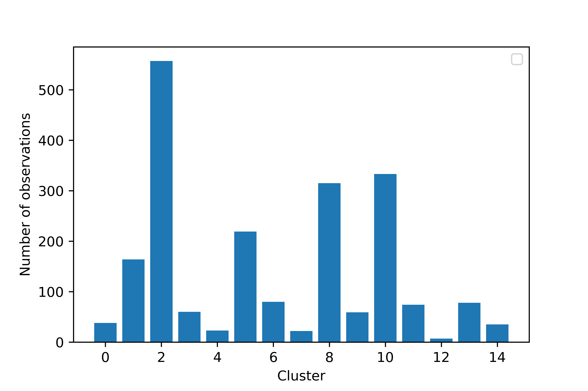

[](http://quantlet.de/)

## [](http://quantlet.de/) **DCA_comparison_cluster_sizes** [](http://quantlet.de/)

```yaml

Name of Quantlet: 'DCA_comparison_cluster_sizes'

Published in: 'Bachelor Thesis "Comparing applicability of prevalent Clustering Algorithms for Document Clustering"'

Description: 'Plotting cluster sizes for k-means'

Keywords: 'k-means, visualization, clustering, plot, quantlet'

Author: Luisa Krawczyk

Submitted:  April 23 by Luisa Krawczyk

Input: 'numpy matrix with with observations as rows and variables as columns'

```



### PYTHON Code
```python

# -*- coding: utf-8 -*-
"""
Created on Sat Apr 20 13:42:48 2019

@author: Luisa
"""
''' Input: matrix is supposed to be a term-document matrix or any numpy matrix 
with observations as rows and variables as columns
'''
from sklearn.cluster import KMeans
import matplotlib.pyplot as plt

K = 15 # choose the number of clusters you want 
km = KMeans(n_clusters=K, n_init=10) # using k-means++ by default
km = km.fit(matrix)

# Getting cluster sizes as a bar plot
from collections import Counter
counter = []
for k in range(K):
    counter.append(Counter(km.labels_)[k])
plt.bar(range(K), counter)
plt.xlabel('Cluster')
plt.ylabel('Number of observations')
plt.legend()
plt.savefig('Number_of_observations_per_cluster_k-means.png', format='png', dpi=800)


```

automatically created on 2019-05-03