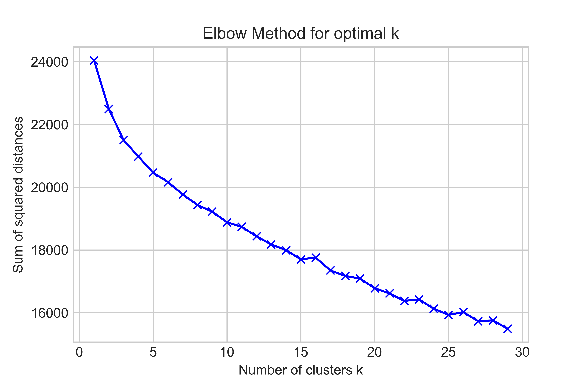
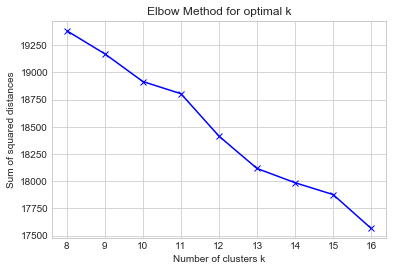

[](http://quantlet.de/)

## [](http://quantlet.de/) **DCA_sum_of_squares_for_k-means** [](http://quantlet.de/)

```yaml

Name of Quantlet: 'DCA_sum_of_squares_for_k-means'

Published in: 'Bachelor Thesis "Comparing applicability of prevalent Clustering Algorithms for Document Clustering"'

Description: 'Plotting the sum of squared distances for each k of a k-means clustering'

Keywords: 'k-means, sum of squares, clustering, bar plot, visualisation'

Author: Luisa Krawczyk

Submitted:  April 23 by Luisa Krawczyk

Input: 'numpy matrix with observations as rows and variables as columns'

```





### PYTHON Code
```python

# -*- coding: utf-8 -*-
"""
Created on Sat Apr 20 15:02:46 2019

@author: Luisa
"""
''' Determining the optimal k for k-means clustering
This code computes the sum of squares for each value of k

Input: matrix is supposed to be a numpy term-document matrix 
with documents as rows and terms as columns
'''

# sum of squares as a function of k, decide for k=15 or k=18 or k=9, 22 or 26
from sklearn.cluster import KMeans
import matplotlib.pyplot as plt

Sum_of_squared_distances = []
K = range(1,30)
for k in K:
    km = KMeans(n_clusters=k)
    km = km.fit(matrix)
    Sum_of_squared_distances.append(km.inertia_)
plt.plot(K, Sum_of_squared_distances, 'bx-')
plt.xlabel('k')
plt.ylabel('Sum_of_squared_distances')
plt.title('Elbow Method For Optimal k')
plt.show()

```

automatically created on 2019-05-03